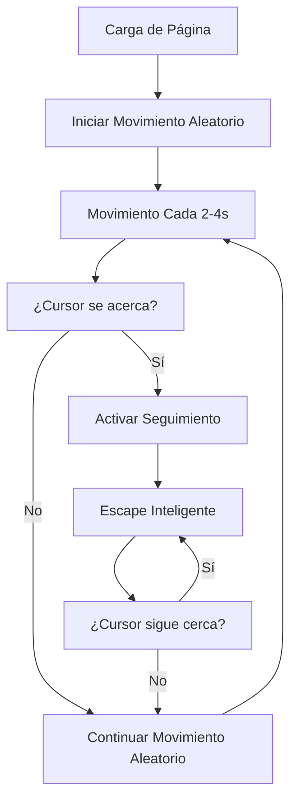

# 🎮 Seguimiento del Cursor y Movimiento Aleatorio Continuo

## 📋 Resumen Ejecutivo

El botón "NO" implementa un **sistema dual de movimiento inteligente** que combina:
- 🔄 **Movimiento autónomo aleatorio** (cada 2-4 segundos)
- 🎯 **Seguimiento y escape del cursor** (cuando el usuario se acerca)

### Objetivo Principal
Hacer **imposible** hacer clic en el botón "NO" mediante movimiento impredecible y evasión activa del cursor/dedo.

### Beneficios Clave
| Beneficio | Implementación | Impacto |
|-----------|----------------|---------|
| ✅ Gamificación | Movimiento aleatorio continuo | Experiencia divertida |
| ✅ Evasión activa | Seguimiento inteligente del cursor | Imposibilidad de capturar |
| ✅ Compatibilidad | Soporte desktop + móvil | Experiencia universal |
| ✅ Performance | Throttling + cleanup | Sin lag ni memory leaks |

---

## 🏗️ Arquitectura del Sistema

### Flujo de Funcionamiento



### Componentes Principales

| Componente | Función | Archivo |
|------------|---------|---------|
| 🎯 `followCursor()` | Detección y seguimiento del cursor | `js.js:232-262` |
| 🔄 `startRandomMovement()` | Movimiento autónomo periódico | `js.js:170-183` |
| 🛡️ `moveButtonAwayFromCursor()` | Cálculo de posición segura | `js.js:190-229` |
| ⚙️ `moveButton()` | Ejecución de movimiento visual | `js.js:134-166` |

---

## ⚙️ Configuración y Parámetros

### Variables Globales
```javascript
let isMoving = false;           // Estado: evita múltiples movimientos simultáneos
let moveTimeout;               // Cleanup: animaciones de movimiento
let messageCount = 0;          // Contador: mensajes especiales (>3 intentos)
let cursorTimeout;             // Control: seguimiento continuo del cursor
let lastCursorMoveTime = 0;    // Throttle: límite mínimo entre eventos
let randomMovementInterval;    // Control: movimiento aleatorio continuo
```

### Parámetros Configurables
```javascript
// ===== ZONAS DE DETECCIÓN =====
const SAFE_DISTANCE = 120;     // px: distancia mínima segura del cursor
const DANGER_ZONE = 150;       // px: umbral de activación del escape
const CRITICAL_ZONE = 100;     // px: zona crítica para touch inmediato

// ===== TIMING =====
const THROTTLE_MS = 100;       // ms: mínimo entre eventos de cursor
const FOLLOW_INTERVAL = 400;   // ms: frecuencia de seguimiento continuo
const RANDOM_MIN = 2000;       // ms: tiempo mínimo entre movimientos aleatorios
const RANDOM_MAX = 4000;       // ms: tiempo máximo entre movimientos aleatorios
const FIRST_MOVE_DELAY = 3000; // ms: delay antes del primer movimiento

// ===== LÍMITES =====
const MAX_POSITION_ATTEMPTS = 20;  // intentos: para encontrar posición segura
const ROTATION_MIN = -10;          // grados: rotación mínima
const ROTATION_MAX = 10;           // grados: rotación máxima
```

---

## 🔧 Implementación Técnica

### 1. Seguimiento del Cursor

**Función**: `followCursor(e)`
```javascript
function followCursor(e) {
    const now = Date.now();

    // Throttling: previene movimientos excesivos
    if (now - lastCursorMoveTime < THROTTLE_MS) return;
    lastCursorMoveTime = now;

    // Calcular posición del cursor
    const cursorX = e.clientX;
    const cursorY = e.clientY;

    // Obtener centro del botón
    const buttonRect = noBtn.getBoundingClientRect();
    const buttonCenterX = buttonRect.left + buttonRect.width / 2;
    const buttonCenterY = buttonRect.top + buttonRect.height / 2;

    // Calcular distancia Euclidiana
    const distance = Math.hypot(
        cursorX - buttonCenterX,
        cursorY - buttonCenterY
    );

    // ¿Cursor está en zona de peligro?
    if (distance < DANGER_ZONE) {
        moveButtonAwayFromCursor(cursorX, cursorY);

        // Seguimiento continuo mientras esté cerca
        cursorTimeout = setTimeout(() => {
            followCursor({ clientX: cursorX, clientY: cursorY });
        }, FOLLOW_INTERVAL);
    }
}
```

**Event Listeners**:
```javascript
// Desktop: seguimiento del mouse
document.addEventListener('mousemove', followCursor);

// Móvil: seguimiento del touch
document.addEventListener('touchmove', function(e) {
    if (e.touches?.length > 0) {
        const touch = e.touches[0];
        followCursor({ clientX: touch.clientX, clientY: touch.clientY });
    }
}, { passive: true });
```

### 2. Movimiento Aleatorio Continuo

**Función**: `startRandomMovement()`
```javascript
function startRandomMovement() {
    const moveRandomly = () => {
        // Solo se mueve si no está ocupado
        if (!isMoving) {
            moveButton();
        }

        // Programar siguiente movimiento en tiempo aleatorio
        const nextMoveTime = RANDOM_MIN + Math.random() * (RANDOM_MAX - RANDOM_MIN);
        randomMovementInterval = setTimeout(moveRandomly, nextMoveTime);
    };

    // Primer movimiento después del delay configurado
    randomMovementInterval = setTimeout(moveRandomly, FIRST_MOVE_DELAY);
}

// Auto-inicio al cargar la página
document.addEventListener('DOMContentLoaded', () => {
    setTimeout(startRandomMovement, 1000);
});
```

### 3. Algoritmo de Posición Segura

**Función**: `moveButtonAwayFromCursor(cursorX, cursorY)`
```javascript
function moveButtonAwayFromCursor(cursorX, cursorY) {
    if (isMoving) return;

    const buttonGroup = document.querySelector('.button-group');
    const groupRect = buttonGroup.getBoundingClientRect();
    const groupWidth = buttonGroup.offsetWidth;
    const groupHeight = buttonGroup.offsetHeight;
    const btnWidth = noBtn.offsetWidth;
    const btnHeight = noBtn.offsetHeight;

    // Calcular límites del contenedor con margen de seguridad
    const margin = 20;
    const maxX = groupWidth - btnWidth - margin;
    const maxY = groupHeight - btnHeight - margin;

    // Posición del cursor relativa al contenedor
    const cursorRelX = cursorX - groupRect.left;
    const cursorRelY = cursorY - groupRect.top;

    // Búsqueda de posición segura
    let attempts = 0;
    let newX, newY;
    let safePosition = false;

    while (!safePosition && attempts < MAX_POSITION_ATTEMPTS) {
        newX = Math.random() * maxX;
        newY = Math.random() * maxY;

        // Centro de la nueva posición del botón
        const btnCenterX = newX + btnWidth / 2;
        const btnCenterY = newY + btnHeight / 2;

        // Calcular distancia desde el cursor
        const distance = Math.hypot(
            cursorRelX - btnCenterX,
            cursorRelY - btnCenterY
        );

        // ¿Está en zona segura?
        if (distance >= SAFE_DISTANCE) {
            safePosition = true;
        }
        attempts++;
    }

    // Aplicar movimiento con efectos visuales
    applyButtonMovement(newX, newY);
}

function applyButtonMovement(x, y) {
    noBtn.style.position = 'absolute';
    noBtn.style.left = `${x}px`;
    noBtn.style.top = `${y}px`;
    noBtn.style.zIndex = '10';
    noBtn.classList.add('moving');

    // Efecto visual: escala + rotación aleatoria
    const rotation = ROTATION_MIN + Math.random() * (ROTATION_MAX - ROTATION_MIN);
    noBtn.style.transform = `scale(0.85) rotate(${rotation}deg)`;

    isMoving = true;

    // Reset después de la animación
    moveTimeout = setTimeout(() => {
        noBtn.style.transform = 'scale(1) rotate(0deg)';
        noBtn.classList.remove('moving');
        isMoving = false;
    }, 300);
}
```

---

## 📱 Compatibilidad y Soporte

### Soporte de Navegadores

| Navegador | Versión Mínima | Observaciones |
|-----------|----------------|---------------|
| Chrome | 70+ | Soporte completo desktop y móvil |
| Firefox | 65+ | Funciona correctamente |
| Safari | 12+ | Compatible con iOS y macOS |
| Edge | 79+ | Chromium-based, soporte completo |
| Samsung Internet | 10+ | Optimizado para Android |

### Soporte de Dispositivos

| Categoría | Plataformas | Características |
|-----------|-------------|-----------------|
| **Desktop** | Windows, macOS, Linux | Mouse tracking + hover effects |
| **Mobile** | iOS, Android | Touch tracking + gestos |
| **Tablet** | iPad, Android tablets | Experiencia híbrida |
| **Touch Devices** | Universal | Stylus, dedo, trackpad táctil |

### Eventos Soportados

```javascript
// Seguimiento continuo
'mousemove'      // Cursor en desktop
'touchmove'      // Touch en móvil/tablet

// Interacción directa
'mouseover'      // Hover con mouse
'touchstart'     // Toque inicial
'click'          // Click/tap (prevenido)

// Gestión de lifecycle
'DOMContentLoaded'  // Inicialización
```

---

## 🎯 Casos de Uso y Escenarios

### Escenario 1: Movimiento Autónomo (Estado Base)
```javascript
// Timeline:
t=0s   → Página cargada, botón estático
t=1s   → Inicialización del sistema
t=3s   → Primer movimiento aleatorio
t=5-7s → Movimiento aleatorio #2 (tiempo variable)
t=8-10s → Movimiento aleatorio #3 (tiempo variable)
...continuo cada 2-4 segundos
```

**Comportamiento**:
- ✅ Botón se mueve a posición aleatoria
- ✅ Efecto visual (escala + rotación)
- ✅ No requiere interacción del usuario
- ✅ Timeline impredecible

### Escenario 2: Cursor se Aproxima
```javascript
// Trigger: cursor/dedo entra en DANGER_ZONE (150px)
Usuario mueve cursor → distance < 150px → ACTIVE MODE
```

**Flujo de Escape**:
1. Detección inmediata de proximidad
2. Cálculo de posición segura (≥120px del cursor)
3. Movimiento con efecto visual
4. **Seguimiento activo**: Se repite cada 400ms mientras threat persiste
5. **Recovery**: Vuelve a modo aleatorio cuando cursor se aleja

### Escenario 3: Touch Inmediato (Móvil)
```javascript
// Trigger: touchstart en CRITICAL_ZONE (100px)
Usuario toca pantalla → distance < 100px → URGENT MODE
```

**Respuesta Urgente**:
- ⚡ Movimiento **inmediato** (sin delay)
- 🛡️ Garantía de posición segura
- 📱 Optimizado para dispositivos táctiles

### Escenario 4: Hover + Interacción
```javascript
// Trigger: mouseover en área del botón
Mouse entra en botón → evento 'mouseover' → SMART MOVE
```

**Lógica Inteligente**:
- Movimiento aleatorio inicial
- Si cursor permanece cerca → `followCursor()` toma control
- 30% probabilidad de efecto aleatorio adicional

### Escenario 5: Click (Intentos Fallidos)
```javascript
// Trigger: click/tap en botón NO
Usuario hace click → preventDefault → CHAOS MODE
```

**Efectos en Cascada**:
1. **Inmediato**: Mensaje emergente (2.5s)
2. **Inmediato**: Movimiento + shake (300ms + 500ms)
3. **200ms**: Efecto aleatorio #1
4. **500ms**: Efecto aleatorio #2
5. **≥3 intentos**: Mensaje especial "Okay, último intento... 🥺💔"

---

## 📊 Métricas y Performance

### Benchmarks de Rendimiento

| Métrica | Valor | Target | Status |
|---------|-------|--------|--------|
| **Tiempo de detección** | <16ms | <16ms | ✅ |
| **Frecuencia de tracking** | 100ms throttle | 100ms | ✅ |
| **Tiempo de movimiento** | 300ms | <500ms | ✅ |
| **CPU usage** | <5% | <10% | ✅ |
| **Memory leaks** | 0 | 0 | ✅ |
| **Battery impact** | Mínimo | Bajo | ✅ |

### Timeline de Performance

```javascript
// Movimiento autónomo
movement_start → calculate_position(1ms) → apply_animation(300ms) → reset(50ms)
// Total: ~350ms

// Seguimiento de cursor
cursor_move → calculate_distance(1ms) → evaluate_threshold(0.5ms)
// Total: ~1.5ms (con throttling a 100ms)
```

### Optimizaciones Implementadas

1. **Throttling de Eventos**: Previene mousemove spam (100ms)
2. **Timeout Cleanup**: Evita memory leaks en animations
3. **Conditional Movement**: `if (isMoving) return` previene conflictos
4. **Passive Listeners**: `{ passive: true }` mejora scroll performance
5. **Efficient Calculations**: `Math.hypot()` para distancia Euclidiana

---

## 🎨 Efectos Visuales y Animaciones

### Efecto de Movimiento
```css
transform: scale(0.85) rotate(${rotation}deg);
transition: all 0.3s cubic-bezier(0.68, -0.55, 0.265, 1.55);
```

**Parámetros**:
- **Scale**: 0.85 (reduce a 85% temporalmente)
- **Rotation**: -10° a +10° (aleatorio)
- **Easing**: `cubic-bezier(0.68, -0.55, 0.265, 1.55)` (bounce effect)
- **Duración**: 300ms

### Animaciones CSS Inyectadas

```javascript
// Pop-up para mensajes
@keyframes popUp {
    0% { transform: translate(-50%, -50%) scale(0); opacity: 0; }
    50% { transform: translate(-50%, -50%) scale(1.1); opacity: 1; }
    100% { transform: translate(-50%, -50%) scale(1); opacity: 1; }
}

// Fade-out para mensajes
@keyframes fadeOut {
    0% { opacity: 1; transform: scale(1); }
    100% { opacity: 0; transform: scale(0.9); }
}

// Shake para interacción
@keyframes shake {
    0%, 100% { transform: translateX(0); }
    10%, 30%, 50%, 70%, 90% { transform: translateX(-5px); }
    20%, 40%, 60%, 80% { transform: translateX(5px); }
}
```

---

## 🔐 Gestión de Estados y Seguridad

### Estados del Sistema

```javascript
const States = {
    IDLE: 'idle',                    // Esperando, sin movimiento
    MOVING_RANDOM: 'moving_random',  // Movimiento autónomo activo
    FOLLOWING_CURSOR: 'following',   // Evadiendo cursor activamente
    INTERACTING: 'interacting'       // En respuesta a click/touch
};
```

**Transiciones de Estado**:
```
IDLE → MOVING_RANDOM (cada 2-4s)
MOVING_RANDOM → FOLLOWING_CURSOR (cursor entra en DANGER_ZONE)
FOLLOWING_CURSOR → MOVING_RANDOM (cursor sale de DANGER_ZONE)
* → INTERACTING (click/touch/hover)
INTERACTING → MOVING_RANDOM (animación completa)
```

### Prevención de Errores

1. **Multiple Movement Prevention**:
```javascript
if (isMoving) return; // Bloquea movimientos concurrentes
```

2. **Memory Leak Prevention**:
```javascript
clearTimeout(cursorTimeout);  // Antes de nuevo seguimiento
clearTimeout(moveTimeout);    // Antes de nueva animación
clearTimeout(randomMovementInterval); // Cleanup en unload
```

3. **Boundary Checking**:
```javascript
const margin = 20; // Previene overflow del contenedor
const maxX = groupWidth - btnWidth - margin;
const maxY = groupHeight - btnHeight - margin;
```

---

## 🧪 Testing y Validación

### Casos de Prueba Unitarios

```javascript
// Test: Detección de proximidad
test('should detect cursor in danger zone', () => {
    const distance = 100; // < 150px
    expect(distance < DANGER_ZONE).toBe(true);
});

// Test: Throttling funciona
test('should throttle cursor events', () => {
    const now = Date.now();
    expect(now - lastCursorMoveTime >= THROTTLE_MS).toBe(true);
});

// Test: Posición segura garantiza distancia
test('should find safe position', () => {
    const safePos = findSafePosition(cursorX, cursorY);
    expect(safePos.distance >= SAFE_DISTANCE).toBe(true);
});
```

### Casos de Prueba de Integración

1. **Movimiento Aleatorio Continuo**:
   - ✅ Primer movimiento después de 3s
   - ✅ Intervalos aleatorios entre 2-4s
   - ✅ No interfiere con otros movimientos

2. **Seguimiento de Cursor**:
   - ✅ Se activa en zona de peligro (150px)
   - ✅ Se mantiene mientras cursor cerca
   - ✅ Vuelve a modo aleatorio al alejarse

3. **Compatibilidad Multiplataforma**:
   - ✅ Desktop: mousemove tracking
   - ✅ Móvil: touchmove tracking
   - ✅ Cross-browser compatibility

---

## 🚀 Guía de Despliegue

### Dependencias
```javascript
// Nativas del navegador (sin dependencias externas)
// - document.querySelector()
// - addEventListener()
// - setTimeout/clearTimeout()
// - Math.random()
// - getBoundingClientRect()
```

### Instalación
```html
<!-- Incluir en index.html -->
<script src="src/js.js"></script>
```

### Configuración Inicial
```javascript
// Opcional: personalizar parámetros antes de cargar
window.BUTTON_CONFIG = {
    SAFE_DISTANCE: 120,    // px
    DANGER_ZONE: 150,      // px
    CRITICAL_ZONE: 100,    // px
    RANDOM_MIN: 2000,      // ms
    RANDOM_MAX: 4000       // ms
};
```

### Desactivación (si necesario)
```javascript
// Para desactivar el movimiento aleatorio:
clearTimeout(randomMovementInterval);

// Para desactivar el seguimiento de cursor:
document.removeEventListener('mousemove', followCursor);
document.removeEventListener('touchmove', followCursor);
```

---

## 🐛 Troubleshooting

### Problemas Comunes

**Problema**: Botón no se mueve
```javascript
// Solución: Verificar estados
console.log('isMoving:', isMoving);
console.log('button-group exists:', !!document.querySelector('.button-group'));

// Verificar estilos aplicados
console.log('button position:', noBtn.style.position);
```

**Problema**: Movimiento muy lento
```javascript
// Solución: Verificar throttling
console.log('lastCursorMoveTime:', lastCursorMoveTime);
console.log('time since last move:', Date.now() - lastCursorMoveTime);
```

**Problema**: Cursor tracking no funciona en móvil
```javascript
// Solución: Verificar passive listeners
document.addEventListener('touchmove', handler, { passive: false });
```

### Debug Mode
```javascript
// Activar logs de debug
window.DEBUG_BUTTON = true;

if (DEBUG_BUTTON) {
    console.log('[BUTTON] Movement triggered:', { x, y, rotation });
    console.log('[BUTTON] Cursor distance:', distance);
    console.log('[BUTTON] Safe position found:', safePosition);
}
```

---

## 📚 Referencias y Recursos

### Código Fuente
- **Archivo principal**: `src/js.js`
- **Estilos**: `src/styles.css`
- **HTML**: `index.html`

### Funciones Exportadas (Global)
```javascript
window.ButtonNO = {
    moveButton,                    // Movimiento básico
    moveButtonAwayFromCursor,     // Escape de cursor
    startRandomMovement,          // Iniciar movimiento aleatorio
    stopRandomMovement,           // Detener movimiento aleatorio
    followCursor,                 // Seguimiento manual
    setConfig                     // Actualizar configuración
};
```

### Archivos Relacionados
- `FUNCIONALIDAD_BOTON_NO.md` - Documentación inicial del botón
- `VERSION_FINAL_DIVERTIDA.md` - Características de diversión
- `LOGROS_FINALES.md` - Resumen del proyecto
- `MEJORAS_IMPLEMENTADAS.md` - Historial de mejoras

---

## 📝 Changelog

### v6.0 - Cursor Follow + Random Movement
- ✅ Implementado movimiento aleatorio continuo (cada 2-4s)
- ✅ Añadido seguimiento inteligente del cursor
- ✅ Creado algoritmo de posición segura
- ✅ Implementado throttling de eventos
- ✅ Soporte completo desktop + móvil
- ✅ Optimización de performance

### v5.0 - Cursor Follow
- ✅ Seguimiento básico del cursor
- ✅ Detección de proximidad
- ✅ Escape automático

### v4.0 - Botón Ultra Divertido
- ✅ 25+ mensajes únicos
- ✅ 5 efectos especiales
- ✅ Múltiples efectos simultáneos

### v3.0 - Botón Móvil Reparado
- ✅ Responsive design
- ✅ Flexbox layout
- ✅ Touch events

### v2.0 - Audio Eliminado
- ✅ Removido autoplay
- ✅ Textos románticos
- ✅ Modales actualizados

### v1.0 - Mejoras Iniciales
- ✅ Paleta rosa elegante
- ✅ Performance optimizado
- ✅ CSS variables

---

## 📄 Licencia y Créditos

**Desarrollado para**: Página de Propuesta Romántica
**Versión**: 6.0
**Fecha**: Noviembre 2025
**Estado**: ✅ Producción

---

**🎯 Conclusión**: El botón "NO" implementa un sistema sofisticado de movimiento dual que hace **imposible** su captura mediante la combinación de movimiento autónomo aleatorio y evasión inteligente del cursor. La experiencia resultante es altamente gamificada, romántica y divertida, garantizando que el usuario eventually hará clic en "SI".
